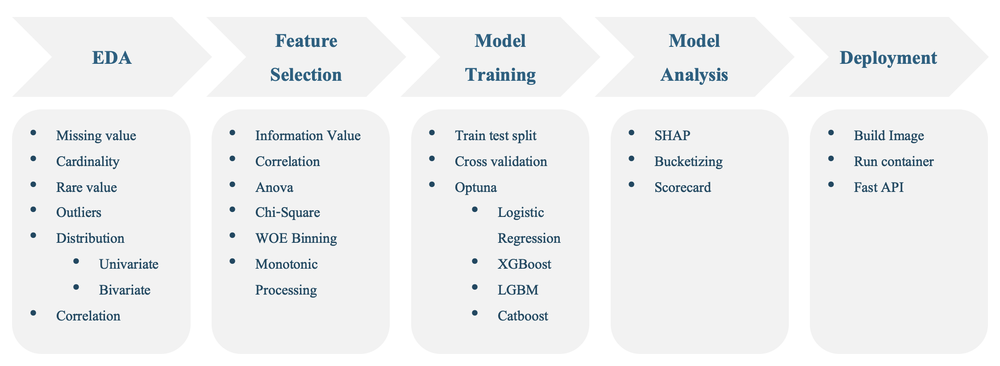

# Credit Scoring

A machine learning credit scoring system deployed as a REST API using FastAPI.

This project demonstrates an **end-to-end credit risk modeling pipeline**, including feature engineering, feature selection, model training, and real-time scoring via API.

---

## Project Overview

Financial institutions use credit scoring models to estimate the probability that a borrower will default.

This project simulates a **production-style credit scoring system** that:

- conducts **Exploratory Data Analysis (EDA)**
- performs feature selection using **Information Value (IV)**
- filters correlated variables
- binning with WOE (apply monotonic)
- trains a machine learning model using Optuna
- analyzes machine learning model and output
- deploys the model as a **FastAPI scoring service**

The API receives customer information and returns a **credit risk score**.


---

## Tech Stack

- Python (Pandas, Numpy, Matplotlib)
- Optbinning
- Scikit-learn
- Optuna
- FastAPI
- Uvicorn

---

## Project Structure
```
credit-score
├── app                     # FastAPI application for model serving
│   ├── main.py             # API entry point and endpoint definitions
│   └── scoring.py          # Inference pipeline: load artifacts, transform input, generate score
│
├── data
│   ├── artifacts           # Serialized objects used for model inference
│   │   ├── feature_use.pkl     # List of features used by the trained model
│   │   ├── logistic_model.pkl  # Trained logistic regression model
│   │   └── optbinning.pkl      # Optimal binning object for WOE transformation
│
│   ├── interim             # Intermediate datasets during data preparation
│   │   ├── 10K_Lending_Club_Loans_final_features.csv
│   │   └── 10K_Lending_Club_Loans.csv
│
│   ├── predicted           # Model prediction outputs
│   │   ├── data10K_Lending_Club_Loans_predicted_bin.csv
│   │   └── data10K_Lending_Club_Loans_predicted.csv
│
│   ├── processed           # Cleaned and transformed datasets
│   │   └── 10K_Lending_Club_Loans_optbinning.csv
│
│   └── raw                 # Original dataset before preprocessing
│       └── 10K_Lending_Club_Loans.csv
│
├── Dockerfile              # Container configuration for deploying the API
│
├── notebook                # Research and experimentation notebooks
│   ├── 01_data_exploration.ipynb   # Exploratory Data Analysis (EDA)
│   ├── 02_feature_selection.ipynb  # Feature importance & IV analysis
│   ├── 03_model_training.ipynb     # Model development and training
│   ├── 04_model_analysis.ipynb     # Model evaluation and diagnostics
│   └── 05_deployment.ipynb         # Testing inference and API deployment
│
├── README.md               # Project documentation
├── requirements.txt        # Python dependencies
│
└── src                     # Core machine learning pipeline implementation
    ├── __init__.py
│
    ├── data_eda            # Data exploration utilities
    │   ├── data_eda.py         # Functions for statistical exploration
    │   └── plot.py             # Visualization functions for EDA
│
    ├── features            # Feature engineering and transformation
    │   └── features_eng.py     # Feature creation, binning, WOE transformation
│
    ├── models              # Model training and evaluation logic
    │   ├── model_analysis.py   # Model diagnostics (ROC, KS, confusion matrix)
    │   └── model_training.py   # Training pipeline for logistic regression model
│
    ├── pipeline            # End-to-end ML workflow orchestration
│
    └── utils               # Shared utilities
        └── logger.py           # Logging configuration for pipeline tracking
```

---

## Installation

Clone the repository

```
git clone https://github.com/sirawitjariya-png/credit-score.git

cd credit-score
```

Create virtual environment

```
python -m venv venv
```

Activate environment
```
source venv/bin/activate
```

Install dependencies
```
pip install -r requirements.txt
```

---
## Dataset
[10K_Lending_Club_Loans.csv](data/raw/10K_Lending_Club_Loans.csv)

**Target Variable**

`is_bad`

- 1 = bad loan (default)
- 0 = good loan (fully paid)
This is the target variable for your credit scoring model.

<br></br>
**Dataset Feature Description**


| Column Name              | Description                                                              |
| ------------------------ | ------------------------------------------------------------------------ |
| `loan_amnt`              | The amount of the loan applied for by the borrower.                      |
| `funded_amnt`            | The total amount funded by investors for the loan.                       |
| `term`                   | Loan repayment period, typically 36 or 60 months.                        |
| `int_rate`               | Interest rate assigned to the loan, reflecting borrower risk level.      |
| `installment`            | Monthly payment amount owed by the borrower.                             |
| `grade`                  | Lending Club credit grade ranging from A (low risk) to G (high risk).    |
| `sub_grade`              | A more granular sub-category of the credit grade (e.g., A1, B3).         |
| `emp_title`              | Borrower's job title.                                                    |
| `emp_length`             | Length of employment (e.g., `<1 year`, `3 years`, `10+ years`).          |
| `home_ownership`         | Housing status such as RENT, OWN, or MORTGAGE.                           |
| `annual_inc`             | Annual income reported by the borrower.                                  |
| `verification_status`    | Indicates whether the borrower's income has been verified.               |
| `purpose`                | Purpose of the loan (e.g., debt consolidation, credit card, car).        |
| `title`                  | Borrower-provided title describing the loan purpose.                     |
| `zip_code`               | Borrower ZIP code (partially masked).                                    |
| `addr_state`             | State where the borrower resides.                                        |
| `dti`                    | Debt-to-income ratio calculated as total monthly debt divided by income. |
| `delinq_2yrs`            | Number of delinquent accounts in the last two years.                     |
| `earliest_cr_line`       | Date of the borrower’s earliest credit account.                          |
| `inq_last_6mths`         | Number of credit inquiries made in the last six months.                  |
| `mths_since_last_delinq` | Months since the borrower's last delinquency.                            |
| `mths_since_last_record` | Months since the borrower's last public record (e.g., bankruptcy).       |
| `open_acc`               | Number of open credit accounts.                                          |
| `pub_rec`                | Number of derogatory public records.                                     |
| `revol_bal`              | Total revolving credit balance.                                          |
| `revol_util`             | Revolving credit utilization rate (used credit / credit limit).          |
| `total_acc`              | Total number of credit accounts ever opened.                             |
| `initial_list_status`    | Loan listing status (`f` = fractional, `w` = whole).                     |
| `policy_code`            | Internal policy code used by Lending Club.                               |


---
## Run Data Exploration (Optional)
notebook/01_data_exploration.ipynb

This step explores:
- missing values
- cardinality
- rare value features
- feature distribution
- target imbalance
- correlation analysis
- data format that should be pre-processing

After performing exploratory data analysis (EDA), we applied feature selection to improve model performance, stability, and interpretability. The following types of features were removed:

- `High Missing Values`: Features with a large proportion of missing data were excluded due to limited reliability and potential bias in imputation.

- `High Cardinality Features`: Variables with too many unique categories (e.g., free-text fields) that cannot be effectively grouped or binned were removed to avoid overfitting and complexity in modeling.

- `Low Variance (Single Unique Value)`: Features containing only one unique value were dropped, as they provide no predictive power.

- `Redundant Features`: Highly correlated or duplicate features were removed to reduce multicollinearity and simplify the model.

This process ensures that only meaningful, stable, and model-relevant features are retained for downstream modeling and scorecard development.

---
## Run Feature Selection and Pre-processing
notebook/02_feature_selection.ipynb

This stage performs:
- Information Value (IV) calculation
- correlation filtering
- feature importance analysis
- Weight of Evidence (WOE) transformation
- monotonic processing

We performed additional selection based on predictive power and multicollinearity:

- `Low Information Value (IV)`: Features with low Information Value were removed, as they have weak predictive power in distinguishing between good and bad borrowers.

- `High Correlation`: Highly correlated features were eliminated to reduce multicollinearity, ensuring model stability and improving interpretability of the scorecard.

This step helps retain only the most informative and independent features for building a robust credit scoring model.

Output: 
```
data/processed/
└── 10K_Lending_Club_Loans_optbinning.csv #Dataset with used features and WOE bin transformed
```
```
data/artifacts/
└── optbinning.pkl #Object for binning used features
```


---
## Train the Credit Scoring Model
notebook/03_model_training.ipynb

This stage performs:

- Model training using optuna
    - Logistic Regression
    - XGBoost
    - LGBM
    - CatBoost
- Best model selection

After tuning, the best model was selected based on validation performance. This approach ensures:

- Optimal hyperparameters for each model

- Fair comparison across different algorithms

- Robust and generalizable predictive performance

The final selected model is used for credit scoring and deployment.

Output:
```
data/processed/
├── data10K_Lending_Club_Loans_predicted.csv # Dataset with prediction with original features value
└── data10K_Lending_Club_Loans_predicted_bin.csv # Dataset with prediction with binned features value
```
```
data/artifacts/
├── feature_use.pkl # Features used in model
├── logistic_model.pkl # Final best model
```

---
## Dockerfile config

```
FROM python:3.13.5

WORKDIR /app

# install system dependencies
RUN apt-get update && apt-get install -y \
    build-essential \
    gcc \
    && rm -rf /var/lib/apt/lists/*

# copy requirements first (faster builds)
COPY requirements.txt .

RUN pip install --upgrade pip
RUN pip install --no-cache-dir -r requirements.txt

# copy project
COPY . .

EXPOSE 8000

CMD ["uvicorn", "app.main:app", "--host", "0.0.0.0", "--port", "8000"]
```

---
## app.main detail

scoring.py contains function to
1. pre-processing
2. binning
3. predicting

Which we can call score_customer to payload data to do all three above processes to get the prediction

```
from fastapi import FastAPI
from pydantic import BaseModel
from typing import List
from app.scoring import score_customer

app = FastAPI(
    title="Credit Scoring API",
    description="API for predicting credit score using trained model",
    version="1.0"
)


class CustomerData(BaseModel):
    data: List[dict]


@app.get("/")
def home():
    return {"message": "Credit Scoring API is running"}


@app.post("/score")
def score(payload: CustomerData):

    print("INPUT RECEIVED:")
    print(payload.data)

    predictions = score_customer(payload.data)

    return {
        "scores": predictions
    }
```

---
## Build container

```
docker build -t credit-scoring .
```
Check image
```
docker images
```
Run Container
```
docker run -p 8000:8000 credit-scoring
```
---


## Running the API

Start the FastAPI server

API will run at http://127.0.0.1:8000

Interactive documentation http://127.0.0.1:8000/docs

---

## API Endpoints

### Health Check

```
GET /
```

Response
```
{
"message": "Credit Scoring API is running"
}
```


### Credit Score Prediction

```
POST /score
```
Example Request
```
{'data': 
    [
        {
            'loan_amnt': 4000,
            'term': ' 60 months',
            'int_rate': '7.29%',
            'grade': 'A',
            'annual_inc': 50000.0,
            'verification_status': 'not verified',
            'purpose': 'medical',
            'inq_last_6mths': 0.0,
            'revol_util': 12.1,
            'total_acc': 44.0,
            'installment': 79.76
        }
    ]
}
```

Example Response
```
{
"scores": [0.09566960804156632]
}
```

## Author

Sirawit Jariyapongpaiboon

Data Scientist specializing in machine learning and credit risk modeling.

GitHub: https://github.com/sirawitjariya-png